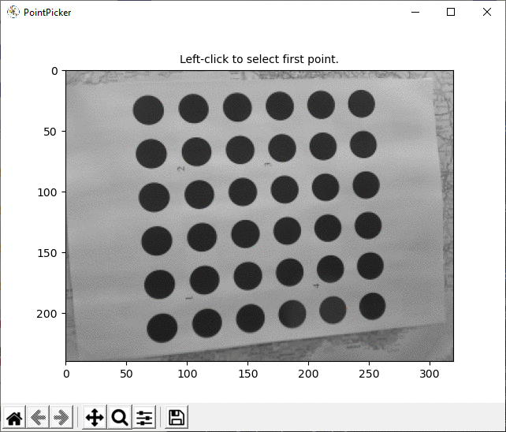

[](https://opensource.org/licenses/MIT)

# PointPicker

Annotate **points** or **bounding boxes** in images using simple GUI. It runs on top of *matplotlib* so you don't need to install heavyweight GUI libraries to make it work. Mark points, zoom in and out and at the end save selected coordinates to CSV file. 

<p align="center">
  
</p>

## Installation

Run `pip install -r requirements.txt` in your local environment.

## Running

Run `python annotate.py` to without any arguments or with `-h` to display help (using `docopt`). The only required argument is the absolute path to the directory with images. At the moment there's no way to filter images by name or extension - all images within the directory will be read and displayed.

To run the application using sample data (point selection, no annotations limit, no window timeout):

```
python annotate.py ./data/
```

## Usage

After you run the application, a window with your first image should pop-up. Use:

* *Left mouse-button* to select a point in image,
* *Right mouse-button* to undo selection (can be used multiple times),
* *Middle mouse-button* to accept existing selections and save them to file.
* *Scroll down/up* to zoom in and out to be able to select points more precisely.

After you confirm selections using *Middle mouse-button* close the window to start processing next image.
